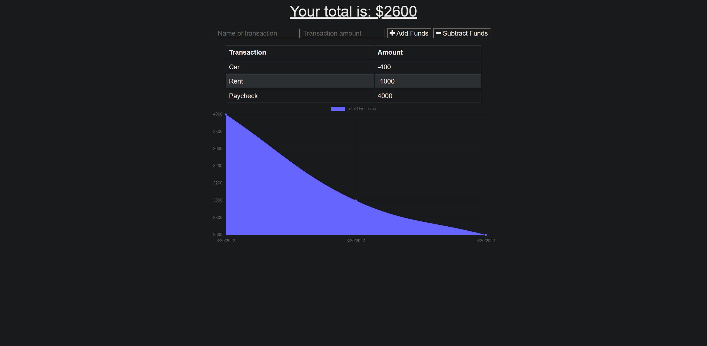

# Budget Tracker

# Purpose

A progressive web application that allows you to track your budget offline and online.

## Installation

- Clone the repository to your preferred development environment.
- Install Node.js and Mongodb on your system if you don't have it already.
- Run npm install to install all dependencies (Mongoose and Express).

## Built With

- JavaScript
- Node.js
- Mongoose
- Express

## Website

https://sheltered-plains-94321.herokuapp.com/

## Credits

Made by Mike Bashford
